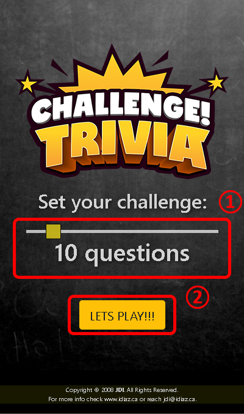
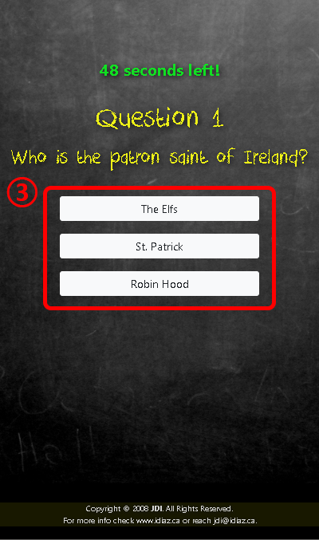
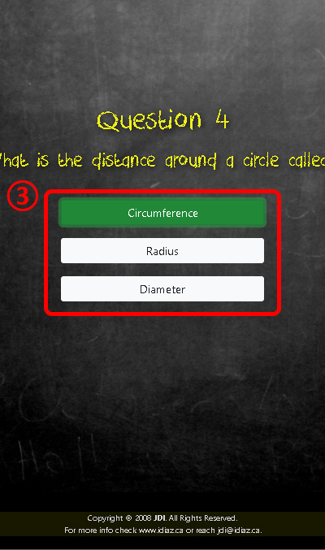
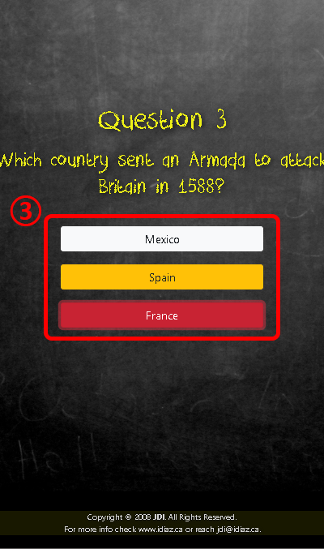
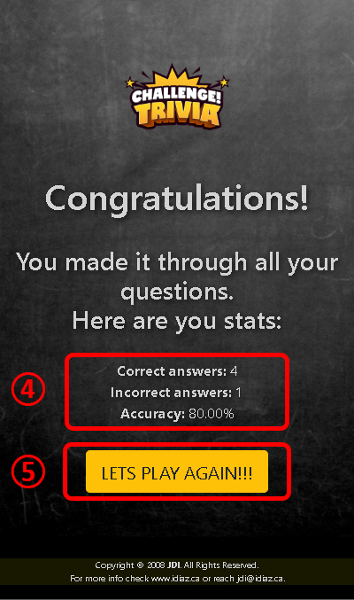

# TriviaGame
> **Cretaed by:**     Juan I Diaz (jdi@idiaz.ca)

> **Date:**           December 2018

## DESCRIPTION
Trivia game using JavaScript for the logic and jQuery to manipulate HTML. The game uses objects with to handle all the questions and their possible answers. The process of the game is based on shuffling the questions array and its answers to minimize the chance for the user to get repeated questions through out a few games. 

## INSTRUCTIONS
1. Upon load, set the amount of questions to receive on a GAME.
2. Click **LETS PLAY!**
3. The questions will be displayed one at a time with three posible options. Only one answer will be correct.
   - Read the question and select the answer by clicking on it's button.
   - If you chose the correct answer the button will turn GREEN.
   - If you chose any of the incorrect answers the button will turn RED and the correct answer will turn YELLOW... now you are learning!
   - After a few seconds you will receive a new question.
4. After all questions have been presented you will get your stats:
    + Correct answers
    + Incorrect answers
    + Accuracy (percentage)
5. Want to play again... go ahead... click **LETS PLAY AGAIN!!!**

## SCREENSHOTS

## BUILDING TOOLS
- HTML, CSS
- Javascript and jQuery
- Bootstrap v4

## QUESTIONS OR COMMENTS
- Logo image taken from [Trivia Brothers](http://triviabrothers.com).
- Feel free to contact the developer @ <jdi@idiaz.ca>!
- See the project [live](https://juanidiaz.github.io/TriviaGame/).
